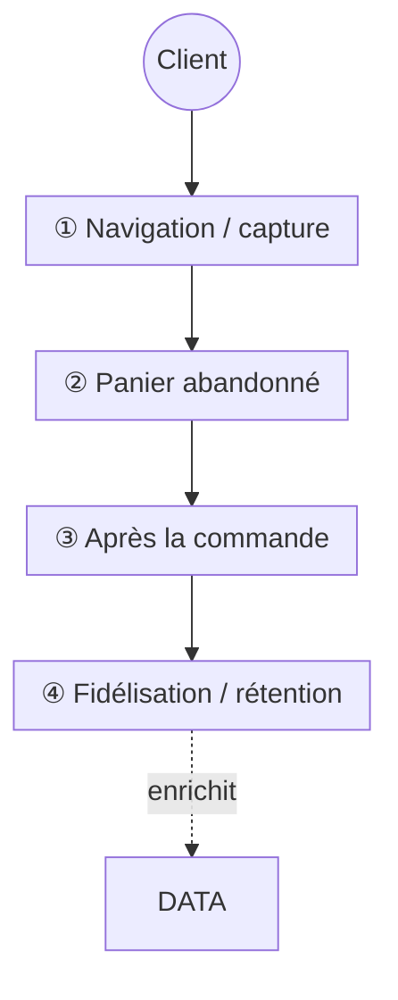

# Skill — HubSpot Workflows Audit & Cartographie

## §0 But — comprendre l'automatisation d'un compte, d'un coup

Quand on arrive sur un compte CRM (ou qu'on veut « voir clair » sur ce qui tourne tout seul), on **cartographie TOUS ses workflows** : c'est la base pour comprendre comment le compte est automatisé, **qui** a construit quoi, et pour piloter ensuite (refonte, ménage, devis). Ce skill **aspire l'inventaire complet des définitions via API**, **complète par l'UI** ce que l'API ne sait pas (créateur, volumes d'enrôlés), classe les flows en familles, flag les problèmes de santé, et produit un **doc d'audit** + une **carte visuelle Mermaid**.

> C'est le **jumeau** de `hubspot-segments-audit`. Même philosophie (pull API → résumé lisible → flags santé → doc familles + cartographie + reco), autre objet : les **workflows** au lieu des **segments**.

## §1 Méthode = API d'abord, MAIS elle a 2 angles morts

L'**API est LA base** pour la structure : rapide, complète, déterministe (ex. 43 flows + leurs actions + déclencheurs en une passe). Mais elle **ne rend que la DÉFINITION** d'un flow. Deux choses qu'elle **ne donne JAMAIS** et qu'on va chercher dans l'UI (§3) :

- **le CRÉATEUR** du workflow (colonne « Créé par » — capital pour dire « mi4 a fait le cœur métier, l'agence la plomberie »),
- **les VOLUMES d'enrôlés** (total + récent — capital pour dire ce qui tourne vraiment vs ce qui dort).

**Endpoints** (Private App token, scope `automation` — cf `hubspot-crm` / `secrets.local`) :
- `GET /automation/v4/flows?limit=100&after=…` → **liste** tous les flows (résumé : `id`, `name`, `isEnabled`, `objectTypeId`). Paginer via `paging.next.after`.
- `GET /automation/v4/flows/{flowId}` → **définition complète** : `actions[]` (avec leur `type`) + `enrollmentCriteria` (le déclencheur).

> 🔴 **Un `GET` liste ne suffit PAS — il faut le `GET /{id}` par flow** pour avoir actions + déclencheur. Et **un 200 ne prouve rien** (règle client `pastry-chefs-boutique/CLAUDE.md` §11) : après tout appel, on **re-GET et on compare** le champ réel à ce qu'on croit avoir — l'API HubSpot avale des champs en silence (elle stocke `BATCH_EMAIL` quand on demande `AUTOMATED_EMAIL`, etc.).

## §2 Script réutilisable (pull définitions + profil d'actions + flags → dump UTF-8)

> ⚠️ Windows : écrire la sortie dans un **fichier UTF-8** (pas `print` → crash cp1252 sur accents/emoji). Token depuis un fichier gitignored (`secrets.local`, cf `hubspot-marketing-segments` §2). Laisse **volontairement vides** les colonnes `Créateur` et `Enrôlés` : elles se remplissent depuis l'UI (§3) — l'API ne les a pas.

```python
import json,urllib.request,urllib.error
from collections import Counter
TOKEN=open("<path>/secrets.local").read().split("HUBSPOT_PRIVATE_APP_TOKEN=",1)[1].split("\n")[0].strip()
H={"Authorization":"Bearer "+TOKEN,"Content-Type":"application/json"}
def call(m,u,b=None):
    d=json.dumps(b).encode() if b is not None else None
    r=urllib.request.Request(u,data=d,method=m,headers=H)
    try:
        x=urllib.request.urlopen(r);bd=x.read().decode();return x.status,(json.loads(bd) if bd.strip() else {})
    except urllib.error.HTTPError as e: return e.code,{}
OBJ={"0-1":"Contact","0-2":"Company","0-3":"Deal","0-5":"Ticket"}
ACT={"DELAY":"Délai","DELAY_UNTIL_DATE":"Délai","EMAIL":"Envoi email","SINGLE_CONNECTION":"Envoi email",
     "SET_PROPERTY":"Set propriété","EDIT_RECORD":"Set propriété","ASSOCIATE_OBJECTS":"Assoc.",
     "LIST_BRANCH":"Branche","BRANCH":"Branche","WEBHOOK":"Webhook 🔗","CREATE_TASK":"Tâche"}
def first_prop(o):                       # 1re propriété citée n'importe où dans le déclencheur
    if isinstance(o,dict):
        v=o.get("property")
        if isinstance(v,str): return v
        for x in o.values():
            p=first_prop(x)
            if p: return p
    elif isinstance(o,list):
        for x in o:
            p=first_prop(x)
            if p: return p
    return None
# 1) LISTER tous les flows (résumé)
flows=[];after=None
while True:
    u="https://api.hubapi.com/automation/v4/flows?limit=100"+("&after=%s"%after if after else "")
    c,r=call("GET",u); flows+=r.get("results",[])
    after=(r.get("paging") or {}).get("next",{}).get("after")
    if not after: break
# 2) GET la DÉFINITION de chaque flow → profil d'actions + déclencheur + flags santé
rows=[]
for f in flows:
    fid=f.get("id"); c,d=call("GET","https://api.hubapi.com/automation/v4/flows/%s"%fid)
    acts=Counter(a.get("type") for a in d.get("actions",[]))
    prof=" · ".join("%s×%d"%(ACT.get(t,t),n) for t,n in acts.items()) or "(aucune)"
    ec=d.get("enrollmentCriteria") or {}; trg=ec.get("type","?"); prop=first_prop(ec)
    name=f.get("name","") or ""; on=bool(f.get("isEnabled")); nact=sum(acts.values())
    flags=[fl for fl,cond in [
        ("OFF",not on),
        ("BROUILLON-ABANDONNÉ",(not on) and name.lower().startswith("unnamed workflow")),
        ("VIDE-0-action",nact==0),
        ("DÉJÀ-ARCHIVÉ","archive" in name.lower()),
    ] if cond]
    rows.append((fid,OBJ.get(f.get("objectTypeId"),f.get("objectTypeId")),name[:52],
                 "ON" if on else "off","%s%s"%(trg,"(%s)"%prop if prop else ""),prof,flags))
# 3) DUMP lisible (ON d'abord, puis alpha) — colonnes UI laissées vides (§3)
rows.sort(key=lambda x:(x[3]!="ON",x[2].lower()))
with open("<path>/_workflows-dump.local","w",encoding="utf-8") as fo:
    fo.write("# %d flows (%d ON / %d off)\n\n"%(len(rows),sum(r[3]=="ON" for r in rows),sum(r[3]!="ON" for r in rows)))
    fo.write("| ID | Objet | Nom | Etat | Déclencheur | Actions | ⚠️ | Créateur (UI) | Enrôlés total/7j (UI) |\n")
    fo.write("|--|--|--|--|--|--|--|--|--|\n")
    for x in rows:
        fo.write("| `%s` | %s | %s | %s | %s | %s | %s |  |  |\n"%(x[0],x[1],x[2],x[3],x[4],x[5]," ".join(x[6])))
```

## §3 Les 2 angles morts → lecture UI (créateur, enrôlés) + Make = boîte noire

L'API n'a **ni** le créateur **ni** les enrôlés. On les lit dans l'UI, une fois, pour compléter les 2 colonnes vides du dump :

- **Ouvrir la liste des workflows** : `https://app.hubspot.com/workflows/{portail}/view/all` → **`get_page_text`** (Chrome MCP). La table liste **« Créé par »** + **volumes d'enrôlés** (total, et souvent « X sur 7 jours »). Recouper par nom/ID avec le dump API.
- **Créateur = clé de lecture** : c'est ce qui permet de dire « **mi4** (l'ancienne agence) a bâti le cœur métier lifecycle · **l'agence (Florent)** a bâti la plomberie data ». La **couleur de la carte Mermaid = le créateur** (§5).
- **🔗 Make / n8n / Zapier = BOÎTE NOIRE.** Un flow qui envoie de la donnée à Make (action `WEBHOOK`, ou une propriété « … envoyée à Make ») ne montre côté HubSpot **que sa moitié** : le vrai scénario vit **sur le compte Make du client**. → on le **note** (« 🔗Make »), on **demande l'accès au client** pour vérifier, et on **ne touche à rien** sans go explicite. On documente uniquement ce que le workflow HubSpot fait (« tague X et l'envoie à Make pour Y »), pas ce qu'on ne voit pas.

## §4 Flags santé (le « bilan »)

- **OFF** (désactivé) — normal (saisonnier, en pause) **ou** oublié ? Le créateur + la date aident à trancher.
- **BROUILLON-ABANDONNÉ** — nom `Unnamed workflow - <date>` **et** off = essai jamais fini (il y en a souvent une pile — cf Pastry Chef : ~10 des 20 éteints).
- **VIDE-0-action** — coquille sans aucune action.
- **DÉJÀ-ARCHIVÉ** — nom qui porte déjà la balise `🗄️ ARCHIVE …` (convention client, cf ci-dessous).

> ⚖️ **On ARCHIVE, jamais on ne supprime.** Un workflow mort/raté se **renomme** avec une balise en tête `🗄️ ARCHIVE <YYYY-MM-DD> — <pourquoi>` (règle `Clients/CLAUDE.md` §2), on n'y touche plus, purge éventuelle après ~6 mois. **Rigueur** : ne jamais conclure « inutile » sur un simple indice (OFF, faible volume) → **inspecter `actions` + `enrollmentCriteria` réels** avant d'affirmer, et croiser avec le créateur/les enrôlés UI (un faible volume peut être une niche voulue).

## §5 Le doc d'audit (livrable type) + carte Mermaid

Structure (cf `memory/clients/pastry-chefs-boutique/audit-workflows.md`, le livrable **prouvé** : 43 flows, 23 actifs) :

1. **🧭 Ce qui ressort** — qui fait quoi (par créateur), les volumes, les points Make. 3-5 lignes en tête.
2. **🟢 MÉTIER / lifecycle marketing** (table triée par volume) — `ID · Nom · Déclencheur · Actions · Enrôlés total · 7j · Créé par`. C'est le parcours d'achat (anniversaire, panier abandonné, cross-selling, fidélisation, inactivité…).
3. **🔧 DATA OPS / plomberie** (même table) — owners, copies d'ID, associations entreprise↔transaction, set marketing. Ça tourne **sous** le parcours.
4. **⏻ Les éteints** (contexte, table légère `ID · Objet · Nom`).
5. **🗺️ Carte visuelle Mermaid** (ci-dessous).
6. **▶️ Reste à cadrer / devis** (créateurs manquants, alertes portail, revenu par workflow = souvent hors V1).

**Les 2 familles = la grille de lecture centrale** :
- **MÉTIER / lifecycle** = ce que le client *veut* (marketing sur le parcours d'achat).
- **PLOMBERIE data** = ce qui *fait tenir* la data (owners, IDs, associations) — invisible mais vital.

**Carte visuelle = Mermaid, PAS Whimsical.** Le source Mermaid est du **texte** → il vit à côté de l'audit, se **régénère avec lui** (jamais de dérive), et **se rend nativement dans Notion** (bloc `mermaid`), en HTML ou sur GitHub. Whimsical = outil externe à piloter à la main = **2ᵉ source à maintenir** = dérive garantie. **Organiser le flowchart sur le parcours d'achat** (Navigation → Panier → Après commande → Fidélisation), **couleur = créateur**, **plomberie data en sous-graphe** dessous, chiffres = enrôlés. Squelette :



**Où poser le livrable** : la carte se rend sur une **page Notion** dans le hub du client (bloc `mermaid`) ; le doc technique miroir reste dans `memory/clients/<slug>/audit-workflows.md` (§32 global : la connaissance = la source, versionnée).

## §6 Prérequis + garde-fou read-only

- **Token** Private App (scope `automation`), gitignored (`secrets.local`). Le bon token full-access sur Pastry Chef = app `get-schemas` (cf `pastry-chefs-boutique/CLAUDE.md` §4bis / `Clients/CLAUDE.md` §4.0), pas un token limité.
- **🔒 Read-only par défaut.** Cet audit **lit**, il ne modifie **aucun** workflow live. Toute modification d'un workflow existant (activer, éditer, archiver-renommer) = **objet live** → **validation Florent AVANT de toucher** (consentement `Clients/CLAUDE.md` §1). Créer un doc/une carte à côté = autonome ; toucher un flow = on demande.
- **Si un jour on ÉDITE** (avec go) : `PUT /automation/v4/flows/{id}` exige le **body COMPLET** (`isEnabled`, `revisionId`, `type` — sinon 400) ; objet `0-1` → `type: CONTACT_FLOW` (`PLATFORM_FLOW` refusé). Détail des pièges v4 : `pastry-chefs-boutique/CLAUDE.md` §12.3quinquies.

## §7 Cas inaugural — Pastry Chef's Boutique (2026-07-21)

Portail `21450353` : **43 flows cartographiés · 23 ACTIFS · 20 OFF** via ce flow (API `automation/v4/flows` + lecture UI pour créateur & enrôlés) → `memory/clients/pastry-chefs-boutique/audit-workflows.md` (dump : `_workflows-dump.local`). Findings : **13 workflows métier lifecycle** (cœur bâti par **mi4** — Arthur Pomiès, Ludwig Meert) · **10 data-ops plomberie** (bâtis par **l'agence**) · **1 point Make** (Browsing History → boîte noire, accès demandé au client) · une pile de « Unnamed workflow » abandonnés côté éteints · carte Mermaid rendue sur Notion (« Cartographie des automatisations HubSpot »).

## Skills liés
`hubspot-segments-audit` (le jumeau, pour les segments) · `revops-api-scripts` (scripter l'API HubSpot) · `crm-investigation-output` (format de rendu) · `hubspot-crm` (règles CRM + token) · `claude-breeze` (le jumeau UI-first — déléguer le diagnostic à Breeze en tokens gratuits, OU auditer écran par écran une fonctionnalité sans API de dump).
